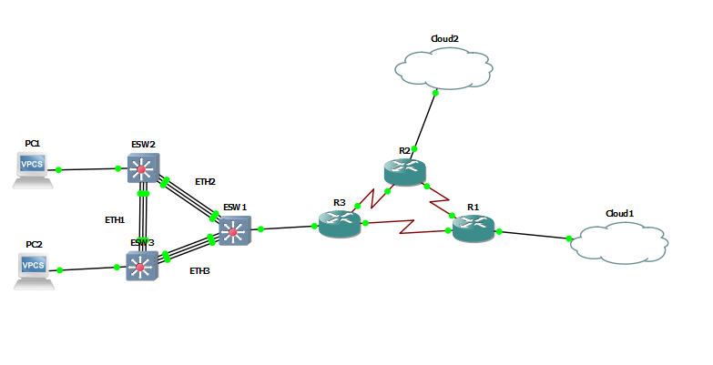

# Redes de computadora 1
## _Practica 3_

### Conduct Report
Churasik Park es una organización que se dedica a la venta de comida rápida en toda
Guatemala, su rápida expansión ha permitido generar una empresa sostenible.
Debido a esto, le han solicitado a usted, como Arquitecto de Soluciones, que diseñe e
implemente una red que permita comunicar a los diferentes puntos de ventas de la
compañía tomando en cuenta todos los requerimientos.
### Datos Estudiantes
| Nombre | Carné |
| ------ | ------ |
| Heidy Carolina Castellanos de León | 201612282 |
| Eduardo Saul Tun Aguilar | 201612124|
| Ricardo Antonio Dubon Contreras  | 201612131 |

- ### Requerimientos de equipo de Equipo

  - ## Topologia 1 y 4 
  - Sistema operativo Windows 10.
  - Procesador i7-6500U core 2.5GHZ
  - 8gb de Memoria Ram ddr3l
  - GNS3 version 2.2.17
  - OpenVPN version 3.3.1.
  - 

  - ## Topologia 2
  - Sistema operativo Windows 10.
  - Procesador i7-6500U core 2.5GHZ
  - 8gb de Memoria Ram ddr3l
  - GNS3 version 2.2.17
  - OpenVPN version 3.3.1.
  - 

  - ## Topologia 3
  - Sistema operativo Windows 10.
  - Procesador i7-6500U core 2.5GHZ
  - 8gb de Memoria Ram ddr3l
  - GNS3 version 2.2.17
  - OpenVPN version 3.3.1.
  - 

  - ## Maquina virtual de Google Cloud
  - Maquina Virtual de Google Cloud con sistema operativo Debian GNU/ Linux 10 (Buster).
  -  OpenVPN utilizada en la maquina virtual fue la 2.4.7

  - ### Requerimientos Para Ejecucion del Archivo GNS3
  - imagen switch c3725-adventerprisek9-mz124-15 
  - NpCap 1.9
  - WinPcap 4.1.3

- ### Carga de archivos de configuracion
  Para realizar la carga de archivos de configuracion en primer lugar se debe crear un archivo de configuracion, copiando la configuracion del switch que se desee, con el siguiente comando.

  > show running-config

  

  Luego se debe copiar y pegar todo en un documento del tipo .cfg para guardarlo y posteriormente copiar y pegarlo en otro switch.

  

- ### Comandos para la configuracion de las topologias
  - ### Carga de archivos de configuracion
  Para realizar la carga de archivos de configuracion en primer lugar se debe crear un archivo de configuracion, copiando la configuracion del switch que se desee, con el siguiente comando.

  > show running-config

  

  Luego se debe copiar y pegar todo en un documento del tipo .cfg para guardarlo y posteriormente copiar y pegarlo en otro switch.

  

- ### Comandos para la configuracion de las topologias

  Comandos para asignar un puerto en modo trunk:
  > configure terminal
  >
  > interfa f#/# (numero que desee)
  >
  > switchport mode trunk
  >
  > end

Comandos para configuracion Etherchannel:
  > configure terminal
  >
  > int range f#/# - # (numero que desee)
  >
  > channel-group # mode on (numero que desee)
  >
  > int port-channel # (numero anterior puesto)

Comando para visualizar los Etherchannel:
  > sh eth su

Comandos para configuracion Etherchannel:
  > configure terminal
  >
  > ip route #(red_destino) #(Mascara) #(Salto)

Comando para visualizar  interfaces:
  > sh ip int br

Comando para visualizar  ruteo:
  > sh ip ro